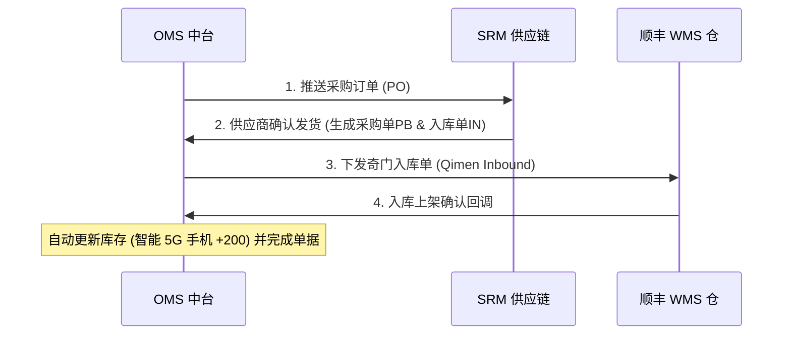
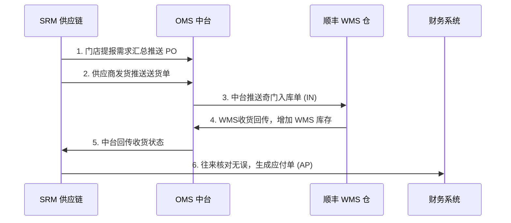
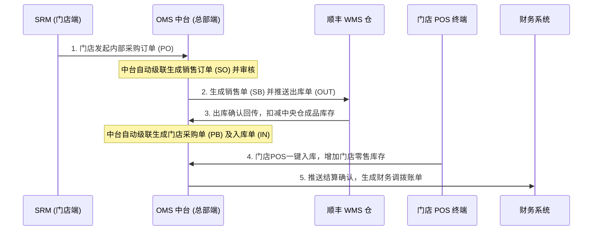
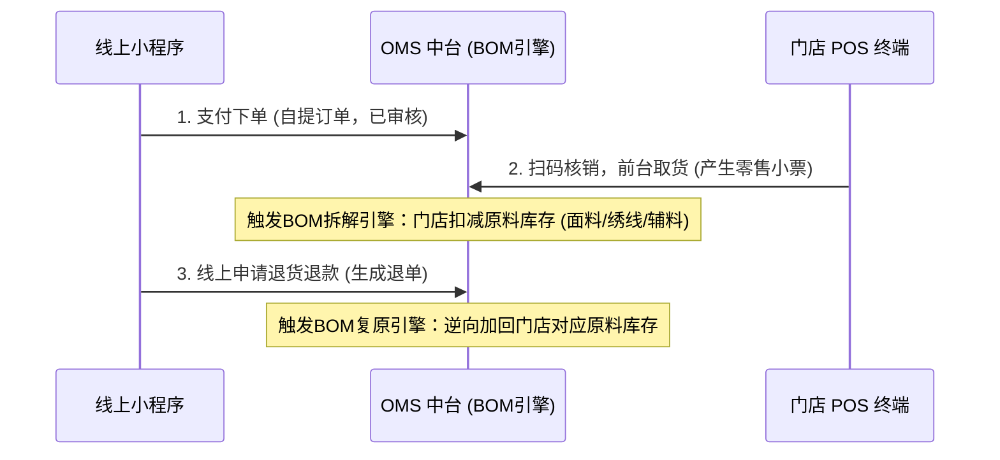
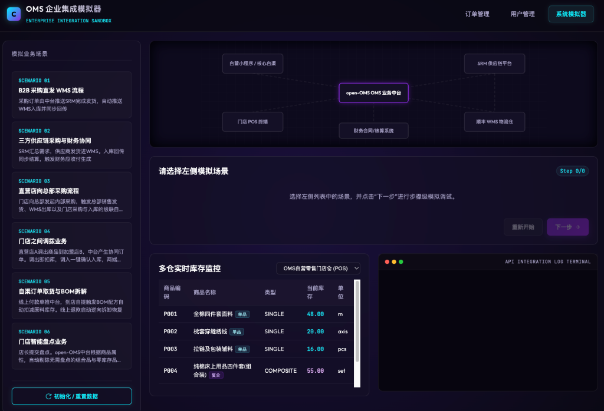

仅仅是抛砖引玉
# OMS (Order Management System) 企业级业务与系统集成模拟中台

[](https://spring.io/projects/spring-boot)
[](https://www.postgresql.org/)
[](LICENSE)
[](#)

> [!NOTE]
> **取材于真实业务场景**：本系统的架构与业务模型提炼自真实的大型新零售及分销业务场景，支持 **200+ 家直营店、加盟店**规模的仓配流转、跨实体结算与智能盘点体系。

本仓库是一个**企业级订单管理系统 (OMS)** 的演示与模拟沙箱项目。不仅实现了基本的订单增删改查 (CRUD) 业务，更在此基础上整合了**多仓联动库存控制、BOM (物料清单) 自动拆解/复原引擎、以及与 WMS、SRM、自营小程序、财务核算等多个外部系统的集成报文模拟**。

为了帮助开发者和架构师更好地理解大型零售、供应链和多仓零售体系下的中台设计，项目内置了一个**可视化系统集成模拟器 (Simulator)**，通过动态拓扑图与实时库存流转，全景式呈现企业级核心业务闭环。

---

## 🚀 项目亮点

1. **多仓流转与库存精准控制**：设计了包括供应商虚拟仓、集团中央仓、顺丰WMS物理仓、自营/加盟门店仓等多种仓库类型，真实模拟B2B采购、B2C发货、门店调拨和盘点中的库存状态流转。
2. **实时 BOM (物料清单) 拆解引擎**：在自渠订单自提与退款场景中，系统自动将复合商品（如：纯棉床上用品四件套(组合装)）根据配比拆解为原料级库存（全棉四件套面料、枕套穿缝绣线、拉链及包装辅料）并进行增扣，支持逆向退款时的配方物料回加。
3. **主流企业级系统集成模拟**：
   - **WMS (奇门接口)**：模拟奇门标准的入库/出库单据创建与收发货确认回调。
   - **SRM (供应商管理)**：模拟采购申请汇总、供应商接单、发货送货协同。
   - **Finance (财务系统)**：自动触发结算确认，生成卖品调拨单、应付账单 (AP) 等账目凭证。
4. **炫酷的可视化沙箱面板**：基于 Vanilla JS 和 CSS 玻璃拟物化设计打造的 Simulator 仪表盘，支持**SVG 拓扑图节点与线路动态高亮闪烁、API 对接 JSON 报文实时终端输出、多仓实时库存监控（带变动绿色/红色渐变闪烁效果）**。

---

## 📐 系统集成拓扑架构 (Simulation Topology)

可以使用以下 Mermaid 图直观地了解各个系统组件在集成流转中的角色：

```mermaid
graph TD
    subgraph 零售与分销渠道
        Core[自营小程序 / 核心自渠]
        POS[门店 POS 终端]
    end

    subgraph 核心中台 (中央大脑)
        OMS[OMS 业务中台]
    end

    subgraph 供应链与仓储
        SRM[SRM 供应链平台]
        WMS[顺丰 WMS 物流仓]
    end

    subgraph 财务合规
        Finance[财务合同/核算系统]
    end

    Core <-->|订单推送 / 状态变更| OMS
    POS <-->|门店销存 / 盘点 / 调拨| OMS
    SRM <-->|采购计划 / 供应商协同| OMS
    OMS <-->|奇门接口 / 出入库反馈| WMS
    OMS -->|预记账 / 调拨结算单| Finance
    SRM -->|应付款凭证| Finance
    SRM <-->|直发入库单| WMS
```

---

## 💼 六大企业核心业务流模拟

### 1. B2B 采购直发 WMS 流程
中台新建采购订单 (PO) 推送 SRM，供应商确认发货后由 OMS 创建奇门入库单推至顺丰 WMS，WMS 收货确认后回传中台，自动完成采购单并增加 WMS 仓库存。



### 2. 三方供应商采购与财务协同流程
在 SRM 提报需求，供应商发货进 WMS。WMS 入库确认回传中台，中台更新库存后状态回传 SRM，最终推送财务系统创建应付款 (AP) 结算凭证。



### 3. 跨实体内部采购流程 (门店向中台直采)
加盟店或下属门店在 SRM 向中台（总部等内部供应链主体）采购，中台自动级联生成销售订单 (SO) 并自动审核；下发销售单与出库单至 WMS，WMS 出库确认后中台扣减中央仓库存，级联生成门店采购入库单，门店一键入库后产生财务结算调拨账单。



### 5. 自渠订单自提与 BOM 拆解引擎
顾客在小程序购买复合类商品（如：四件套组合装），订单推送到中台。顾客到店后，POS 扫码核销。此时**触发中台 BOM 拆解引擎**：因为门店不备成品四件套，系统根据配方比例（1套 = 2.5m面料 + 0.05轴绣线 + 1.0pcs辅料），自动扣减门店仓库对应的原材料实物库存。当用户发起退款时，系统启动**逆向 BOM 复原机制**，把扣减的原料库存原路归还。



### 6. 门店智能盘点业务
店长发起月度盘点，中台会**智能过滤掉组合品（四件套）以及 0 库存物料**，仅下发需要实物盘点的原材料明细。录入实盘数量后，中台实时对比并计算预盈亏。店长审批后，中台自动调整实物仓库存并生成“盘盈盘亏差异调整单”。

---

## 🛠️ 技术栈与项目结构

### 技术栈
* **后端**: Java 17 + Spring Boot 3.2.5
* **数据库**: PostgreSQL
* **ORM 框架**: Spring Data JPA + Hibernate
* **安全框架**: Spring Security (已配置免登录放行测试)
* **前端**: HTML5 + CSS3 (Glassmorphism 玻璃拟物风格) + Vanilla JavaScript (纯原生，轻量交互)
* **构建工具**: Maven

### 核心代码结构
```
oms-demo/
├── pom.xml                                          # Maven 依赖
└── src/
    └── main/
        ├── java/com/example/oms/
        │   ├── config/
        │   │   └── SecurityConfig.java              # 访问控制 (放行模拟器端点)
        │   ├── controller/
        │   │   ├── OmsSimulatorController.java      # 模拟沙箱 API 控制器
        │   │   └── OrderController.java             # 订单核心 REST API
        │   ├── entity/
        │   │   ├── BOM.java                         # BOM 配方实体
        │   │   ├── Product.java                     # 商品/物料主数据实体
        │   │   ├── Stock.java                       # 多仓库存实体
        │   │   ├── Warehouse.java                   # 仓库实体
        │   │   ├── IntegrationLog.java              # 跨系统集成交互日志实体
        │   │   └── Order.java                       # 订单实体 (扩展类型与仓库字段)
        │   ├── repository/                          # JPA Repositories
        │   └── service/
        │       ├── OmsSimulatorService.java         # 六大集成场景模拟器引擎
        │       └── OrderService.java                # 订单业务处理类
        └── resources/
            ├── application.yml                      # 数据库与 JPA 属性配置
            └── static/
                ├── simulator.html                   # 模拟器可视化沙箱前端面板
                └── index.html                       # 订单管理系统主控制台
```

---

## 🏁 快速开始与部署

### 1. 环境准备
* 安装 JDK 17 或以上版本
* 安装 Maven 3.6+
* 安装 PostgreSQL 12+ 并创建数据库 `oms_db`：
  ```sql
  CREATE DATABASE oms_db;
  ```

### 2. 数据库连接配置
编辑 `src/main/resources/application.yml`，修改为你的 PostgreSQL 连接信息：
```yaml
spring:
  datasource:
    url: jdbc:postgresql://localhost:5432/oms_db
    username: postgres          # PostgreSQL 用户名
    password: yourpassword      # PostgreSQL 密码
```

### 3. 运行项目
在项目根目录下执行以下命令：
```bash
# 使用 Spring Boot 插件启动
mvn spring-boot:run
```
或者将其打包成 Jar 包运行：
```bash
mvn clean package
java -jar target/oms-demo-1.0.0.jar
```

### 4. 访问系统
* **订单管理核心主页**：[http://localhost:8080](http://localhost:8080)
* **企业集成模拟器面板 (重点)**：[http://localhost:8080/simulator.html](http://localhost:8080/simulator.html)

#### 模拟器控制面板效果图


---

## 🕹️ 模拟器使用指南

1. **初始化数据**：
   首次打开模拟器页面时，请先点击左下角的 **"初始化 / 重置数据"** 按钮。系统会在数据库中自动生成初始的单品、BOM 配方、5 大仓库（虚拟仓、中央仓、WMS仓、自营/加盟门店仓）以及对应的初始库存。
2. **选择业务场景**：
   在左侧的“模拟业务场景”列表中选择一个您想要测试的业务流（如：*自渠订单取货与BOM拆解*）。
3. **单步模拟调试**：
   点击主面板下方的 **"下一步"** 按钮。您可以观察到：
   * **动态拓扑图**：对应的系统节点和数据传输线路会高亮闪烁并展示动画。
   * **JSON 控制台**：打印出当前步骤产生的 API 集成报文，展示真实的系统对接参数契约。
   * **库存监控**：切换下拉菜单查看不同仓库的库存，当发生扣减或增加时，对应行会有红色/绿色的渐变闪亮动效。
4. **重置与重试**：
   随时点击“重新开始”以复位当前场景，或者点击“初始化 / 重置数据”清空所有产生的业务单据与日志并复原库存。

---

⭐ 如果这个模拟沙箱和中台设计思路对您的工作或学习有所帮助，欢迎在 GitHub 上给本项目点一个 **Star**！如有任何问题或建议，欢迎提交 Issue 或 Pull Request！
