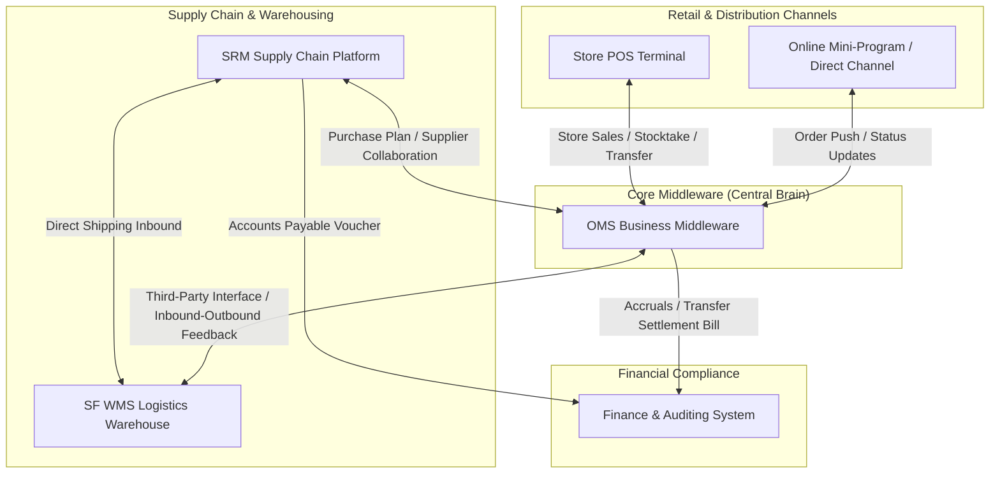
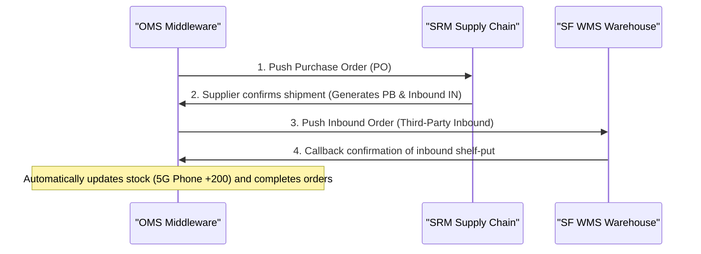
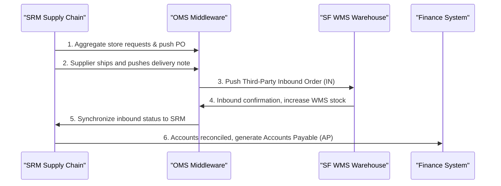
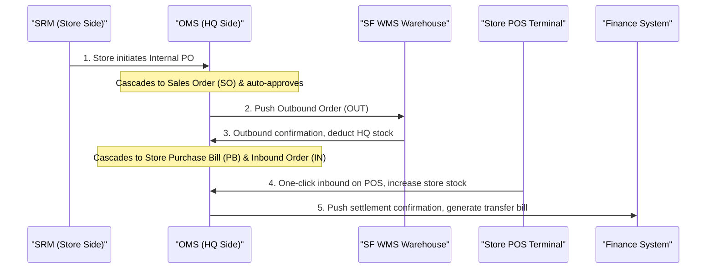
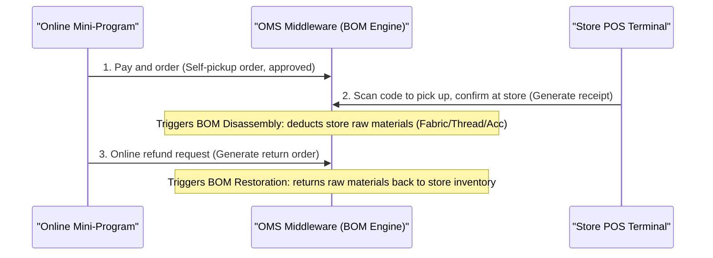

# OMS (Order Management System) Enterprise Business & System Integration Simulation Middleware

English | [简体中文](./README.md)

[](https://spring.io/projects/spring-boot)
[](https://www.postgresql.org/)
[](LICENSE)
[](#)

> [!NOTE]
> **Derived from Real Business Scenarios**: The architecture and business models of this system are extracted from real large-scale retail and distribution scenarios, supporting inventory flows, cross-entity settlement, and intelligent stocktaking for a scale of **200+ direct and franchise stores**.

This repository is a demo and simulation sandbox for an **Enterprise Order Management System (OMS)**. In addition to basic order CRUD operations, it integrates **multi-warehouse inventory control, an automatic BOM (Bill of Materials) disassembly/restoration engine, and simulation integration APIs for external systems such as WMS, SRM, online mini-programs, and financial accounting**.

To help developers and architects better understand mid-platform (Zhongtai) design under large-scale retail, supply chain, and multi-warehouse operations, the project features a **visual integration simulator dashboard** with dynamic topology highlighting and real-time inventory monitoring.

---

## 🚀 Key Highlights

1. **Multi-Warehouse Flow & Precise Inventory Control**: Features virtual supplier warehouses, central warehouses, SF WMS physical warehouses, and direct/franchise store warehouses. Simulates inventory state transitions during B2B purchasing, B2C shipping, store transfers, and stocktakes.
2. **Real-Time BOM (Bill of Materials) Engine**: In self-pickup and refund scenarios, the system automatically decomposes compound items (e.g., Pure Cotton Bedsheet Set) into raw material inventory (Fabric, Thread, Accessories) for deduction, and supports reverse restoration during refunds.
3. **Enterprise Integration Simulation**:
   - **WMS (Third-Party Interface)**: Simulates standard inbound/outbound document creation and confirmation callbacks.
   - **SRM (Supplier Relationship Management)**: Simulates purchase request aggregation, supplier acceptance, and shipping collaboration.
   - **Finance (Accounting System)**: Triggers settlement confirmations and generates transfer bills and Accounts Payable (AP) vouchers.
4. **Interactive Glassmorphic Sandbox Dashboard**: Built with Vanilla JS and CSS glassmorphism, supporting SVG node & link highlighting, real-time JSON log outputs, and dynamic HSL green/red gradient flash animations for inventory updates.

---

## 📐 System Integration Topology (Simulation Topology)

Check the Mermaid diagram below to understand the roles of various components:



---

## 💼 Six Core Enterprise Business Scenarios

### 1. B2B Purchasing Direct to WMS Flow
The middleware creates a Purchase Order (PO) pushed to SRM. Once the supplier ships, OMS generates a Purchase Bill (PB) and Inbound Order (IN) pushed to WMS. Upon receiving, WMS sends a callback, completing the PO and increasing WMS inventory.



### 2. Multi-Party Purchasing & Finance AP Voucher Flow
Store raises requests in SRM, aggregated and pushed to OMS. Supplier ships items into WMS. WMS inbound callback updates stock, synchronized to SRM, which finally notifies Finance to generate Accounts Payable (AP) vouchers.



### 3. Franchise/Store Direct Internal Procurement
Franchise store requests stock in SRM. OMS automatically generates a cascading Sales Order (SO) and approves it; pushes WMS Outbound Order. WMS confirms shipment, OMS deducts Central Warehouse stock, generates store Inbound Order (IN). Store logs receipt in POS, triggering Finance transfer settlement billing.



### 4. Store-to-Store Inventory Transfer Flow
Store A requests an inventory transfer to franchise Store B. The middleware checks stock, generates a Coop Order (CO), deducts stock from A, and prepares an inbound document for B. Once Store B confirms arrival, stock increases, and cross-entity finance reconciliation is generated.

### 5. Self-Pickup & BOM Disassembly/Restoration Engine
A customer orders a compound product (e.g., Bedsheet Set) online and picks it up in Store A. POS triggers the **BOM Disassembly Engine**: since Store A only stocks raw materials, the system deducts Fabric, Thread, and Accessories based on recipe ratios rather than finished sets. When the customer requests a refund, the **Reverse Restoration Engine** returns the raw material inventory to Store A.



### 6. Intelligent Store Stocktake
Store manager initiates monthly stocktaking. The middleware filters out compound items (no active stock) and zero-stock items, sending only raw materials list. Once physical counts are submitted, OMS compares counts, adjusts warehouse inventory, and generates adjustment sheets.

---

## 🛠️ Technology Stack & Project Structure

### Tech Stack
* **Backend**: Java 17 + Spring Boot 3.2.5
* **Database**: PostgreSQL
* **ORM**: Spring Data JPA + Hibernate
* **Security**: Spring Security (Bypassed for easy testing)
* **Frontend**: HTML5 + CSS3 (Glassmorphism styling) + Vanilla JavaScript
* **Build Tool**: Maven

### Core Directory Structure
```
oms-demo/
├── pom.xml                                          # Maven dependencies
└── src/
    └── main/
        ├── java/com/example/oms/
        │   ├── config/
        │   │   └── SecurityConfig.java              # Access control configuration
        │   ├── controller/
        │   │   ├── OmsSimulatorController.java      # Sandbox API Controller
        │   │   └── OrderController.java             # Core Order REST API
        │   ├── entity/
        │   │   ├── BOM.java                         # BOM Recipe Entity
        │   │   ├── Product.java                     # Product/Material Entity
        │   │   ├── Stock.java                       # Multi-Warehouse Stock Entity
        │   │   ├── Warehouse.java                   # Warehouse Entity
        │   │   ├── IntegrationLog.java              # Integration Interaction Log Entity
        │   │   └── Order.java                       # Order Entity
        │   ├── repository/                          # JPA Repositories
        │   └── service/
        │       ├── OmsSimulatorService.java         # 6 integration scenarios engine
        │       └── OrderService.java                # Order Business Service
        └── resources/
            ├── application.yml                      # Database & JPA properties
            └── static/
                ├── simulator.html                   # Simulator Sandbox Panel Frontend
                └── index.html                       # Order management console page
```

---

## 🏁 Quick Start & Deployment

### 1. Prerequisites
* Install JDK 17 or above
* Install Maven 3.6+
* Install PostgreSQL 12+ and create a database named `oms_db`:
  ```sql
  CREATE DATABASE oms_db;
  ```

### 2. Configure Database Connection
Edit `src/main/resources/application.yml` and replace with your PostgreSQL credentials:
```yaml
spring:
  datasource:
    url: jdbc:postgresql://localhost:5432/oms_db
    username: postgres          # Your PostgreSQL username
    password: yourpassword      # Your PostgreSQL password
```

### 3. Run the Application
Run the following command in the project root:
```bash
# Start with Spring Boot plugin
mvn spring-boot:run
```
Or pack it as a runnable jar:
```bash
mvn clean package
java -jar target/oms-demo-1.0.0.jar
```

### 4. Access the Application
* **Order Management Dashboard**: [http://localhost:8080](http://localhost:8080)
* **Enterprise Integration Simulator (Recommended)**: [http://localhost:8080/simulator.html](http://localhost:8080/simulator.html)

#### Simulator Dashboard Screenshot


---

## 🕹️ Simulator Guide

1. **Initialize Data**:
   When opening the simulator dashboard for the first time, click **"Initialize / Reset Data"** at the bottom-left. The system will seed the database with initial products, BOM recipes, 5 warehouses, and corresponding stocks.
2. **Select Scenario**:
   Select an integration workflow from the left panel (e.g. *Self-Pickup & BOM Disassembly*).
3. **Step-by-step Simulation**:
   Click **"Next Step"** at the bottom. You can observe:
   * **Dynamic Topology**: The corresponding node and path highlight with blinking animations.
   * **JSON API Console**: Displays the raw API payload contracts.
   * **Inventory Monitoring**: Switch warehouses to see HSL green/red fade-in effects showing inventory increases or deductions.
4. **Reset**:
   Click "Restart" to reset current scenario steps, or "Initialize / Reset Data" to wipe all order logs and restore initial stocks.

---

⭐ If this simulation sandbox and OMS design helps you, please give this project a **Star**! Feel free to submit Issues or Pull Requests!
